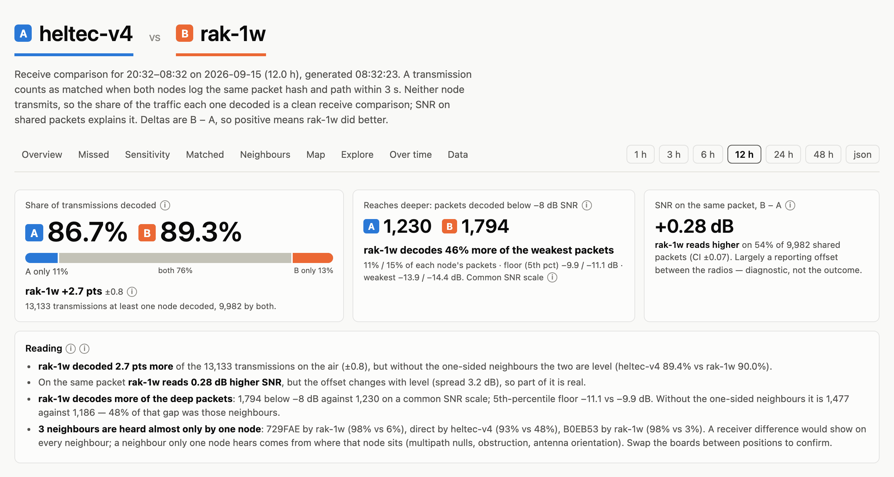

# openhop-rxcompare

[](https://github.com/metrafonic/openhop_compare/actions/workflows/docker.yml)

Compare the receive performance of two openHop LoRa repeaters
listening on the same channel — e.g. two different boards or antennas installed side by
side, both in no-TX mode.

It pulls packet history from each node's openHop API, joins the packets that both nodes
heard (same `packet_hash` + `path_hash` within 3 s), and reports:

- **SNR advantage** per packet, per upstream neighbour and over time (the fair metric —
  RSSI is calibrated differently per radio and is shown but flagged as such)
- packets **only one node** decoded, and how weak they were (sensitivity vs. collisions)
- noise floor and CRC error counts per node
- a self-contained HTML report with hover tooltips, light/dark, and table views



## Run with Docker

A multi-arch image (amd64, arm64) is published to
`ghcr.io/metrafonic/openhop_compare` on every push to `main`.

```sh
cp .env.example .env      # fill in the two node URLs and API keys
docker compose up -d
open http://localhost:8090
```

To build the image yourself instead of pulling it:

```sh
docker build -t ghcr.io/metrafonic/openhop_compare:latest .
docker compose up -d
```

Routes:

| path | what |
|---|---|
| `/` | report for the default window (`HOURS`); `/?hours=24` for another range |
| `/summary.json` | the same numbers as JSON (`?hours=` works here too) |
| `/healthz` | 200 once the first analysis succeeded |

The default window is refreshed every `REFRESH_SEC` in the background; other ranges are
computed on demand and cached for the same period.

## Run without Docker

Needs only Python 3.10+, no third-party packages.

```sh
set -a; . ./.env; set +a
python3 server.py                                 # web app on $PORT (default 8080)
python3 rxcompare.py --hours 6                    # text report
python3 rxcompare.py --hours 6 --html report.html --csv pairs.csv
python3 rxcompare.py --watch 300 --html report.html   # regenerate every 5 min
```

## Configuration

All settings are environment variables — see [`.env.example`](.env.example).

| var | meaning |
|---|---|
| `A_URL`, `A_KEY`, `A_NAME` | node A base URL, API key (`X-API-Key`), display name |
| `B_URL`, `B_KEY`, `B_NAME` | node B |
| `HOURS` | default comparison window (default 3) |
| `REFRESH_SEC` | background refresh / cache lifetime (default 300) |
| `RANGES` | ranges offered in the nav, hours (default `1,3,6,12,24,48`) |
| `LISTEN_PORT` | host port for compose (default 8090) |
| `VERIFY_TLS` | set `false` for self-signed certs |
| `TZ` | timezone for time axes |

API keys are created in the openHop web UI under *Sessions → API tokens*.

## How the comparison works

Both nodes log every packet they decode with RSSI and SNR. A transmission is identified by
`(packet_hash, path_hash)` — the same payload relayed by two different neighbours is two
different transmissions — and matched across nodes when the timestamps are within 3 s.
The comparison window is clamped to the period where both nodes have data, so a restart on
one side doesn't count as missed packets.

Compare **SNR**, not RSSI: different LoRa front ends report RSSI on different calibration
curves (the RSSI scatter in the report typically shows a bend rather than a straight
offset), while SNR is measured against each radio's own demodulator and reflects what
actually got decoded.

## License

MIT
