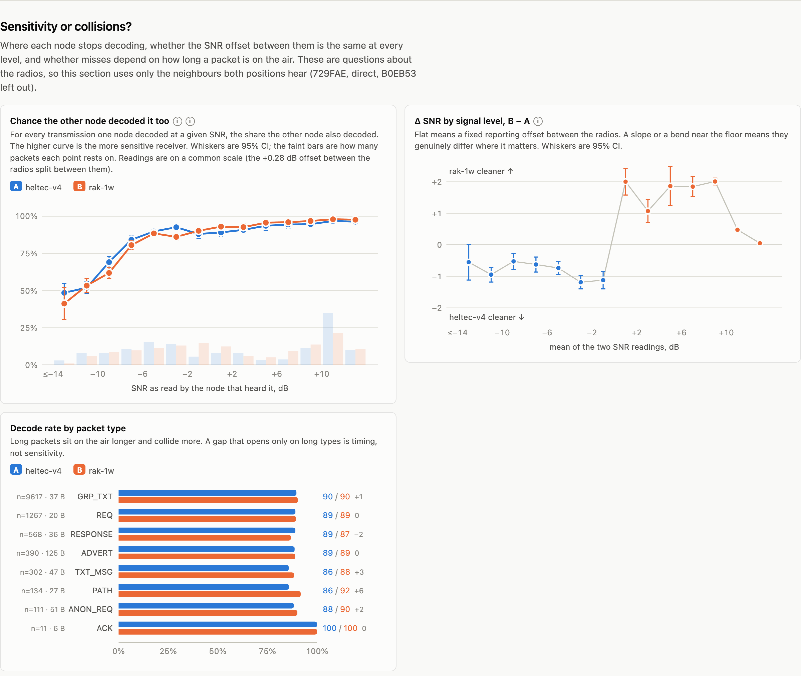
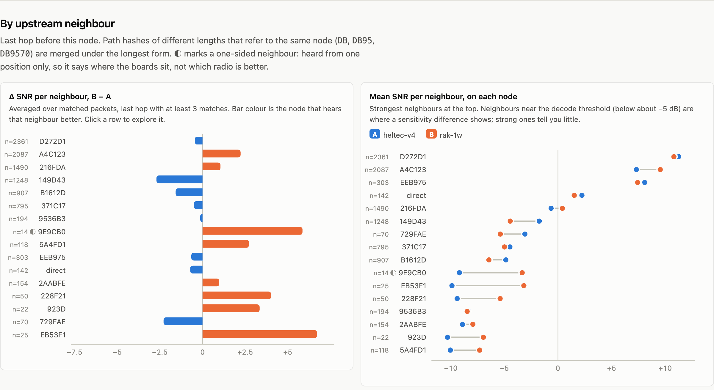
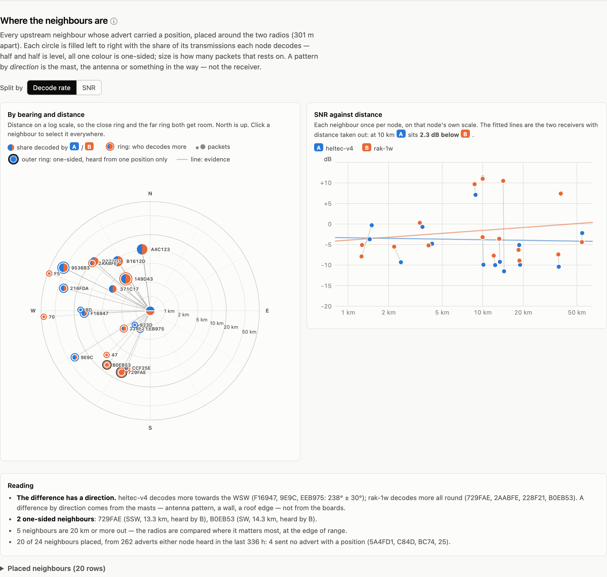
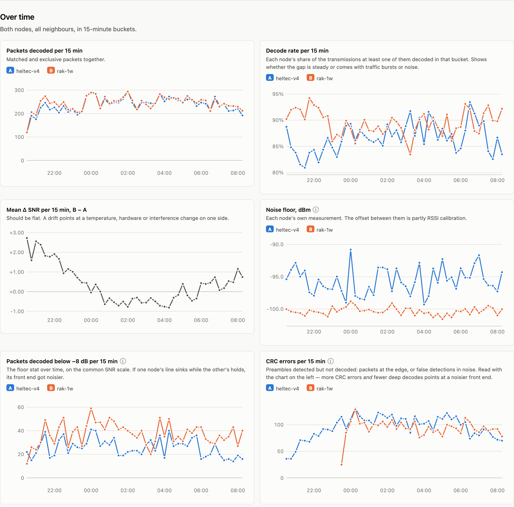
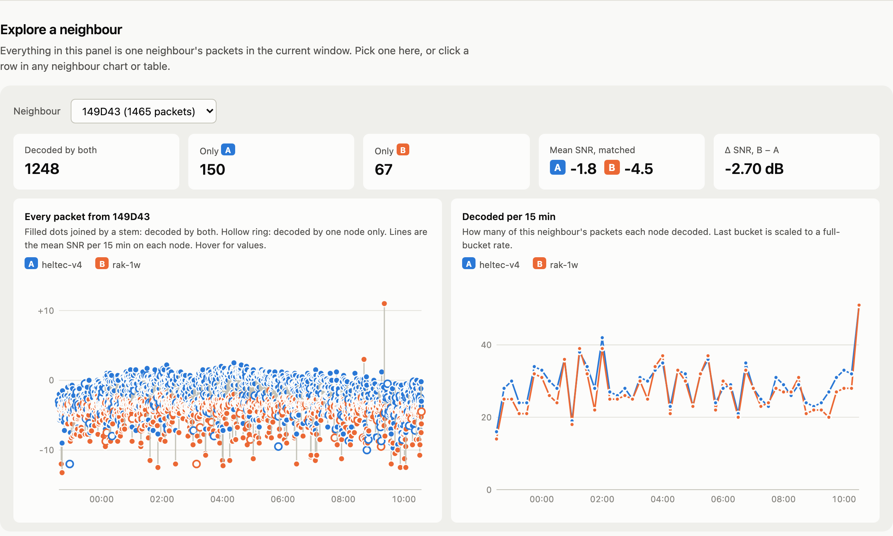

# openhop-rxcompare

[](https://github.com/metrafonic/openhop-rxcompare/actions/workflows/docker.yml)

Compare the receive performance of two openHop LoRa receivers listening on the same channel —
two boards or antennas installed side by side, or **two radios on one multiradio system** — in
no-TX mode (monitor mode works too: the node's own adverts and requests are taken out of the
comparison, and the report says how many there were).

A *receiver* is one radio of one openHop system, or a whole system with its radios folded
together. Configure any number of systems; the report compares two receivers at a time and lets
you switch either side. It pulls packet history from each system's openHop API, joins the packets
both receivers heard (same `packet_hash` + `path_hash` within 3 s — or 250 ms for two radios on
one box, which share a clock), and reports:

- **decode rate** (the headline — neither node transmits, so this is a clean receive comparison):
  of every transmission at least one node heard, the share each node decoded,
  with a paired confidence interval and the same rate without *one-sided neighbours* (hops one
  node hears and the other barely does — position, not receiver)
- a check that the nodes kept quiet: each node's repeater mode and how many packets it sent in
  the window. A node's own packets, and the other node's direct copies of them, are left out
- a **Reading** card that turns the headline numbers into a few sentences: who decodes more,
  whether the SNR offset drifts with signal level (real) or only wobbles about a flat line
  (reporting and quantisation), who reaches deeper, and which neighbours are one-sided
- **SNR on shared packets** (with a confidence interval), per upstream neighbour and over time —
  the diagnostic behind the decode rate, not the outcome (RSSI is calibrated differently per
  radio and is shown but flagged as such)
- packets **only one node** decoded: how weak they were (sensitivity vs. collisions) and
  which neighbours each node misses
- **sensitivity or collisions**: the chance each node decodes a packet, by signal level
  (each node's real floor), the SNR offset by signal level (calibration vs. genuine), and
  decode rate by packet type (long packets collide more)
- **decode rate over time** and a match-quality check (clock offset between the nodes,
  pairs that disagree wildly)
- **per neighbour**: SNR on each node side by side, so threshold-level neighbours stand out
- **where the neighbours are**: every neighbour whose advert carried a position, placed around the
  two radios — a bearing-and-distance radar (inline SVG, log distance), a terrain map (Leaflet,
  loaded on request), SNR against distance with a fit per node, and a reading that says whether the
  difference has a *direction* (the masts) or not (the receivers). Radios more than 1 km apart get
  their own lines and the reading switches to "the split is geography"
- noise floor and CRC errors per node, over the same window
- an interactive **neighbour explorer**: pick a hop and see every one of its packets over the
  window on both nodes, plus its decode counts per bucket
- a self-contained HTML report with hover tooltips, light/dark, phone layout and table views

Upstream hop hashes of different lengths (`DB`, `DB95`, `DB9570` are the same node in openHop
paths) are merged so each neighbour appears once.


## What it looks like

The headline: share of every transmission on the air that each node decoded, who reaches
deeper into the noise, the SNR offset on shared packets, and a Reading card that says what it
adds up to (above). Then the sections behind it:

**Sensitivity or collisions?** — of the transmissions on the air at a given SNR, the share each
node decoded (where a curve drops is that node's floor); the SNR offset by signal level
(flat = calibration, bent = real); decode rate by packet type.



**By upstream neighbour** — SNR delta per last hop, and each neighbour's mean SNR on both nodes
side by side, so the ones sitting at the decode threshold stand out. ◐ marks a one-sided
neighbour.



**Where the neighbours are** — every neighbour whose advert carried a position, on a
bearing-and-distance radar (log distance; each circle is filled with the share each node
decodes), SNR against distance with a fit per node, and a reading that says whether the
difference has a *direction*. The terrain map (Leaflet, loaded on request) sits next to the
radar and is left out of this screenshot.



**Over time** — packets and decode rate per bucket, the SNR delta (should be flat), noise
floor, deep decodes and CRC errors per node.



**Explore a neighbour** — every packet from one hop across the window on both nodes: filled
dots joined by a stem were decoded by both, hollow rings by one node only.



Neighbour hashes and positions in these screenshots are scrambled; the numbers are real.

## Run with Docker

A multi-arch image (amd64, arm64) is published to
`ghcr.io/metrafonic/openhop-rxcompare` on every push to `main`.

```sh
cp .env.example .env      # fill in the two node URLs and API keys
docker compose up -d
open http://localhost:8090
```

That is the two-node setup. For more systems, or to compare the radios of a multiradio one
separately, list them in a `receivers.yml` and mount it (the line is in `docker-compose.yml`):

```sh
cp receivers.example.yml receivers.yml   # one entry per system; keys stay in .env as ${VAR}
# uncomment the receivers.yml volume in docker-compose.yml
docker compose up -d
```

Each system's radios are discovered from its API (openHop tags every reception with
`rx_radio_id`), so a multiradio box offers one receiver per radio plus one for the box as a
whole. The report's nav gains an A row and a B row to pick which two to compare.

To build the image yourself instead of pulling it:

```sh
docker build -t ghcr.io/metrafonic/openhop-rxcompare:latest .
docker compose up -d
```

Routes:

| path | what |
|---|---|
| `/` | report for the default pair and window; `/?a=heltec:local&b=rak&hours=24` for another |
| `/summary.json` | the same numbers as JSON (same query parameters) |
| `/receivers.json` | the receivers on offer and the default pair |
| `/healthz` | 200 once the first analysis succeeded |

The default pair and window are refreshed every `REFRESH_SEC` in the background; other pairs and
ranges are computed on demand and cached for the same period. Two radios on one system share one
fetch of its packet history.

## Run without Docker

Needs Python 3.10+ and, only for reading a `receivers.yml`, PyYAML (`pip install pyyaml`); a
`receivers.json` of the same shape, or the `A_*`/`B_*` variables, need nothing.

```sh
set -a; . ./.env; set +a
python3 server.py                                 # web app on $PORT (default 8080)
python3 rxcompare.py --list                       # the receivers on offer
python3 rxcompare.py --hours 6                    # text report, default pair
python3 rxcompare.py --a heltec:local --b heltec:link --hours 6   # two radios on one system
python3 rxcompare.py --hours 6 --html report.html --csv pairs.csv
python3 rxcompare.py --watch 300 --html report.html   # regenerate every 5 min
```

## Configuration

Receivers come from [`receivers.example.yml`](receivers.example.yml) (copied to `receivers.yml`,
or pointed at with `RECEIVERS=`): per system an `id`, `label`, `url`, `key` (use `${VAR}` to read
it from the environment), optional `lat`/`lon` override and optional labels for its radios, plus a
`default` pair such as `[heltec:local, rak]`. A bare site id means the whole system, `site:radio`
one radio. With no such file the `A_*`/`B_*` variables below describe two systems of one receiver
each — a multiradio system there still has its duplicate decodes folded together, you just cannot
pick its radios apart.

Everything else is an environment variable — see [`.env.example`](.env.example).

| var | meaning |
|---|---|
| `RECEIVERS` | path to the receiver registry (default: `receivers.yml`/`.yaml`/`.json` in the working directory) |
| `A_URL`, `A_KEY`, `A_NAME` | node A base URL, API key (`X-API-Key`), display name — used when there is no registry file |
| `B_URL`, `B_KEY`, `B_NAME` | node B |
| `HOURS` | default comparison window (default 3) |
| `REFRESH_SEC` | background refresh / cache lifetime (default 300) |
| `RANGES` | ranges offered in the nav, hours (default `1,3,6,12,24,48`) |
| `LISTEN_PORT` | host port for compose (default 8090) |
| `VERIFY_TLS` | set `false` for self-signed certs |
| `TZ` | timezone for time axes |
| `A_LAT`, `A_LON`, `B_LAT`, `B_LON` | override a radio's position (default: openHop's `/api/gps`, manual config or fix) |
| `ADVERT_LOOKBACK_H` | how far back to read adverts for neighbour positions (default 336 — nodes advertise once a day or less) |
| `ADVERT_CACHE` | JSON file where adverts accumulate across runs, so a position once seen sticks (the Docker image sets `/data/adverts.json` on a volume) |
| `MAP_TILES`, `MAP_ATTRIB` | Leaflet tile template and attribution (default OpenTopoMap) |
| `MAP_AUTO` | `1` loads the map without the click; otherwise the click is remembered per browser |
| `MAP_GRAY` | tiles are desaturated so only the data carries colour; `0` keeps the tiles' own colours |

API keys are created in the openHop web UI under *Sessions → API tokens*.

## How the comparison works

Every system logs every packet it decodes with RSSI and SNR, and on a multiradio build, with
the radio that decoded it (`rx_radio_id`): one transmission heard by two radios is two rows,
milliseconds apart on the one clock. A receiver for one radio takes the rows tagged to it; a
receiver for a whole system takes them all and keeps the best-SNR row of each such cluster, so
the system counts a transmission once however many of its radios heard it. Rows from before
multiradio was switched on carry no radio id and belong to no radio, so a radio-vs-radio
comparison starts where the tagging did.

Packets a node originated itself (its adverts, openHop's own requests, a companion app's traffic)
sit in the same log with RSSI 0 and are not receptions; they are dropped, and when the node did
send one, the other system's direct copy of it (same hash within 3 s, no upstream hop) is dropped
too, since the sender could not have heard it. Two radios on one system are deaf together while
it sends, which cancels out of their comparison. The report says how many such packets there
were. A transmission is identified by `(packet_hash, path_hash)` — the same payload relayed by
two different neighbours is two different transmissions — and matched across receivers when the
timestamps are within 3 s (250 ms within one system). The comparison window is clamped to the
period where both receivers have data, so a restart on one side doesn't count as missed packets.

When both receivers sit on one system, the checks that exist to tell two boxes apart are dropped
or reworded: there is one clock (no offset to report), one position (a neighbour only one radio
hears is its antenna, not where it stands), one repeater mode, and one noise floor and CRC count,
which both rows show.

Neighbour positions come from the neighbours' own adverts: a MeshCore advert carries the node's
public key, name and (when set) lat/lon, and a hop hash in a path is the first 1–3 bytes of that
key. A hop is placed when the positioned adverts whose key starts with it agree; a 1-byte hash that
several keys start with is left off as ambiguous. Adverts are read from both nodes' packet history
over the last `ADVERT_LOOKBACK_H` and merged into `ADVERT_CACHE`.

Compare **SNR**, not RSSI: different LoRa front ends report RSSI on different calibration
curves (the RSSI scatter in the report typically shows a bend rather than a straight
offset), while SNR is measured against each radio's own demodulator and reflects what
actually got decoded.

## License

MIT
